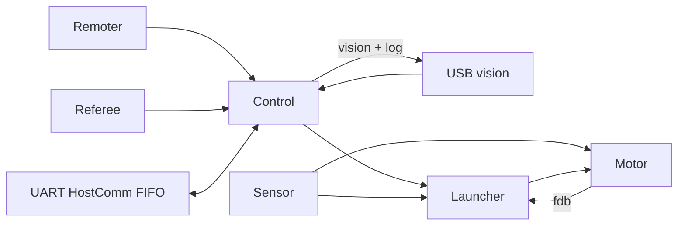

# 飞镖应用迁移与调试

本应用从 `origin/oldframe` 的 `7ad4f98` 迁移到 `refactor/migration` 的
`237b4a2`（本次开始时与远端一致）。目标板为 H723 MC02。
`codex/dart-migration` 中的旧草稿没有合入：它的 yaw 型号、标定值和视觉协议
与本次指定的 oldframe 不一致。

## 目录和启动

业务入口仍是 `app/app.cpp::app_start()`。`params.dart.enabled=true` 时启动
飞镖，关闭时保留 template 的诊断启动流程。板级 ThreadX 入口没有搬到应用。

| 文件 | 职责 |
| --- | --- |
| `app/dart/start.cpp` | 创建启动线程、依次初始化应用；`dart::startup` 查看阶段和结果 |
| `messages.hpp/.cpp` | 明确拥有的 `msg::channel`，无旧 OneMessage topic 注册中心 |
| `control.cpp` | 订阅遥控/裁判/视觉，处理手控、自动条件和当前发射参数 |
| `configuration.hpp/.cpp` | 标定表、距离插值、发射序号和门状态融合 |
| `launcher.cpp` | 装填、预拉、准备、释放状态机；输出 `motor_cmd` |
| `motor.cpp`、`dart_motor.hpp` | 使用现有 DM 服务/PID/PWM，应用内补足 XV2 旧分片命令和多圈位置 |
| `sensor.cpp` | G4 双拉力流、触发锁定和平台归位输入 |
| `vision.cpp` | 原 13 字节视觉 RX/TX 与 25 字节日志，使用 USB BSP |
| `host/` | 原 USART 主机协议、FIFO 和配置读写业务 |
| `monitor.cpp` | 使用既有 LED API 显示通信和 gantry 状态 |
| `config.cmake` | 只生成飞镖应用参数，不替代通用硬件生成器 |



启动线程优先级 1，仅完成一次初始化；原应用 sensor/control/launcher/motor/
host/monitor 分别为 3/5/6/7/17/19。DM 使能的等待在 motor 线程中。
回调只做对应的短交接，UART DMA 使用 `bsp::dma::buffer` 和 `BSP_DMA_BUFFER`。
普通消息是最新值；主机请求、响应必须保留 FIFO，不能用最新值覆盖。

## 配置归属

| 配置 | 本次用途 |
| --- | --- |
| `boards/h723_mc02/h723_mc02.ioc` | CAN 模式/过滤器容量、UART 参数/DMA、TIM1、PE0/PE14 |
| 同目录 `board.json` | `trigger_locked`、`launch_return`、`trigger` 的固定接线 |
| `configs/boards/h723_mc02/params.json` | 逻辑 UART/CAN 别名、DR16/USBX 选择及全部 `dart` 参数 |
| 同目录 `robot.json` | synbelt/yaw/string_l/string_r 总线、ID、方向和消费者组成 |
| `build/<preset>/generated/dart_config.hpp` | 生成的应用常量，只读 |

`params.dart` 分为 motor、launcher、system、sensor、host、vision、monitor、
calibration、distance_table、sequence 和 pre_tension_kg。调参应改这些源配置，
重新 configure/build。运行时 HostComm 和 debugger 改值只留在 RAM，不写 Flash。
GUI 会保留未知应用字段；这些新字段目前需要直接编辑 JSON。

`app/dart/config.cmake` 读取通用生成器已合并的 `params_json`，不增加另一套
默认值，也不改 `configs/cmake/generate_config.cmake` 或任一子模块。

## 旧硬件映射

| 角色 | 配置 |
| --- | --- |
| 同步带 | DM4310，FDCAN1 Classic，ID 2，速度模式＋应用位置环 |
| yaw | DM8009P，FDCAN2 Classic，ID 3，速度模式 |
| 左/右拉弦 | XV2，FDCAN3 Classic extended，地址 2/1，positive_dir 0/1 |
| 扳机 | TIM1 CH3 / PE13，20,000 µs 周期；开 1750 µs、复位 1670 µs |
| 锁定/平台归位 | PE0 低有效 / PE14 高有效 |
| 遥控 | UART5，保留旧 IOC 的 100000 baud / 9N2；需上板确认 |
| 裁判 | USART1，115200 baud |
| G4 力传感器 | UART7，115200 baud，`L + u24le + R + u24le`，原值 / 10000 = kg |
| 上位机 | USART10，115200 baud，RX/TX DMA |
| 视觉与日志 | 既有 USB CDC |

XV2 的旧 `0xC6` 限电流速度命令需要 Classic CAN 扩展 ID 分片，而现有通用
XV2 驱动没有这个发送路径。这里只在应用补足它，没有改通用设备驱动。
现有生成器也不接受 `xv2_x42` model，因此两项使用现有 `unknown` 配置类型，
应用读取生成的 `motors::config`；地址就是 `can_id`，方向从 robot.json 生成。
不能把这两项换成通用驱动并直接发送 11 字节 Classic 帧。

## 保留与明确的差异

- 保留 16 镖标定、距离表、顺序 `[3,4,5,8]`、32 kg 预拉力和原状态机阈值。
- yaw 仍为 DM8009P；没有采用旧迁移草稿里的 XV2 替换。
- oldframe gantry 初始化被注释。本次仍不注册 gantry，不伪造反馈；后续装填在
  gantry 步骤等待，`launcher::debug.gantry_missing` 可见。恢复它需要先确认硬件组成。
- `system.target_override=1` 对应旧强制选基地；设为 `-1` 才读取裁判选择。
  `system.fixed_aim=true` 对应旧 `FORCE_TABLING`，false 使用距离插值。
- `system.legacy_game_gate=true` 保留旧代码没有更新比赛门控的状态；因此默认
  自动分支不会进入自动发射，只会预拉。明确改为 false 后才由裁判 game_status=4
  更新门控。不要把默认自动流程写成已完成赛场验证。
- 保留 Up/Up 自动锁存及遥控离线保持行为；没有另造恢复或急停状态机。
- 删除未启用的霍尔/卷簧、备用 USART2/3 拉力分支和固定文字 UI 演示。
- 完成沿只计数一次，修正旧离线分支重复计数；READY 每次进入重置等待时间，
  防止复用上次未完成的计时。NaN 视觉 yaw 不会被当成已对准。
- USB 处理碎片/连续包。RX `vision.verify_crc=false` 保留旧不验 CRC 的兼容性，
  联调后可开启；TX 仍用原 CRC16。没有修改线上 13/13/25 字节格式。
- 裁判回调只更新本次包字段，收到 GameStatus 不会把尚未收到的门状态当成开门。

电机启动时旧代码的一次 20 rad/s 同步带命令也保留在 `motor.initial_syn_spd`；
不是静态无动作镜像。PID 组合模式 `0x45` 的 D 项在既有库里不生效，原 kd=10
仍被保留。详细说明见 [电机迁移验证](dart-motor-validation.md)。

## Watch 和 PID 调参

优先使用 Debug 镜像，沿用 `.vscode/launch.json` 的 Cortex Debug/LiveWatch。

遥控映射沿用旧操作，拨杆表中的上/中/下对应公共 Remoter 的 up/mid/low：

| 左拨杆 | 右拨杆 | 指令 |
| --- | --- | --- |
| 下 | 下 | relax |
| 下 | 中 | 右摇杆 Y 调同步带位置；每轮增量为 `-right_y * syn_manual_scale` |
| 下 | 上 | 左/右摇杆 Y 分别手动调左右副弦 |
| 中 | 下 | 左摇杆 X 绝对值大于 `trigger_threshold` 时开扳机，否则复位；右 X 调 yaw |
| 中 | 中 | prepare，右 X 调 yaw |
| 中 | 上 | fire，右 X 调 yaw |
| 上 | 上 | 请求/锁存自动；仍受比赛门控和门状态限制 |

初始化先看 `startup`，再看各模块循环计数是否递增。调发射顺序时同时看
`control::debug.cmd`、`launcher::debug.fsm/prep` 与 `motor::debug`，便于区分
指令来源、状态机等待条件和实际反馈。上位机修改的标定见 `state.config`；
它不会直接改变生成的默认值。

| Watch 表达式 | 看什么 |
| --- | --- |
| `dart::startup` | 初始化阶段和 status；stage=9 表示应用线程已创建，电机使能另看 motor::debug |
| `dart::control::debug` | 遥控、视觉、裁判、最终 cmd、自动门控 |
| `dart::state.config` / `.runtime` | 当前 RAM 标定、发射顺序、门状态和发射计数 |
| `dart::launcher::debug` | fsm/prep、cmd、ref、fdb、传感器、缺失 gantry |
| `dart::sensor::debug` | raw_l/raw_r、kg、frames、force_online、UART/GPIO status |
| `dart::motor::debug` | 三个 PID 的 ref/fdb/err/out、使能、速度、角度、扳机状态 |
| `dart::motor::pidtuning` | syn/string_l/string_r 的增益、限幅、模式和临时 ref |
| `dart::host::debug` | CRC/长度/超时、FIFO、UART busy/error |
| `dart::vision::debug` | 原始包、USB 排队/busy、CRC/发送失败计数、tx_status（含未连接） |
| `dart::monitor::debug` | LED 选择状态；白色保留旧未启用 gantry 提示 |

`pidtuning` 的 `ref_override` 默认 false；启用后仅覆盖已经激活的相应 PID，
不会自动切换发射机构模式。`reset=true` 在该 PID 下次执行时清空历史并自动清回
false。调好的参数最终写回 JSON，再关闭临时覆盖。单位见电机验证文档。

## 构建和验证

```powershell
cmake --preset h723-debug
cmake --build --preset h723-debug --parallel 8
cmake --preset h723-release
cmake --build --preset h723-release --parallel 8
python tests/dart/test_board_bindings.py
python tests/dart/test_motor.py
python tests/dart/host_protocol_test.py
python tests/dart/test_app_config.py
python tests/dart/control_runtime_test.py
python tests/dart/io_runtime_test.py
python tests/dart/motor_runtime_test.py
python tests/dart/host_runtime_test.py
```

业务模拟依赖 Unicorn；本工作区已安装到 `build/migration/python`。全新检出可运行
`python -m pip install --target build/migration/python unicorn`，不需要修改固件依赖。

本轮的最终检查和剩余事项见 [交接文档](dart-handoff.md)。构建、编译期协议验证、
模拟测试均不能替代电机、舵机、拉力、USB 和实际装填的板上验证。
