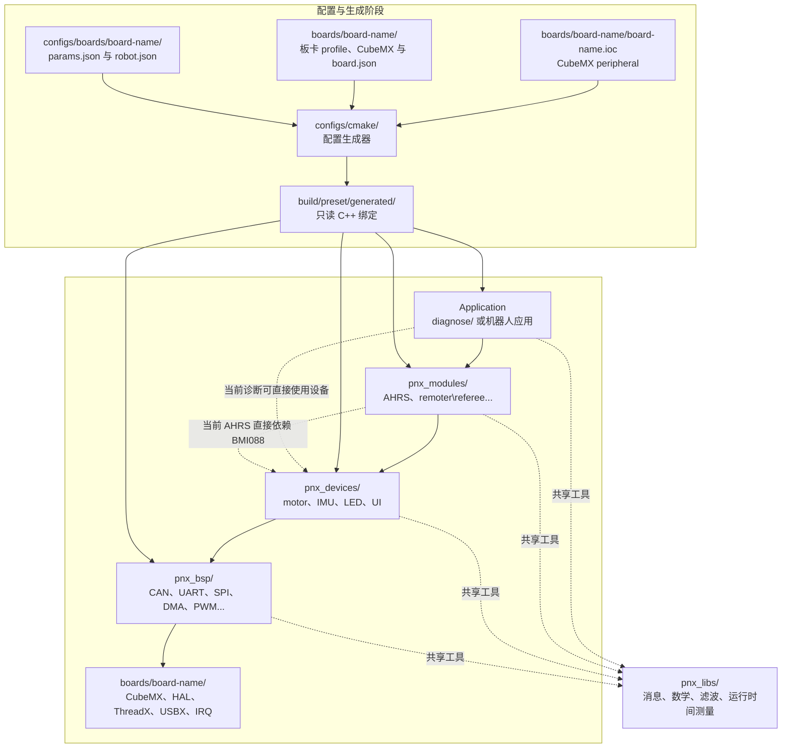

# 项目结构

| 目录 | 职责 |
| --- | --- | 
| `boards/<board>/` | 每块板完整的 STM32CubeMX/HAL/ThreadX/USBX 工程、IOC、启动文件、链接脚本、工具链和 `board.json`。 |
| `configs/boards/<board>/` | 对应板型的应用参数与机器人设备配置。 |
| `configs/cmake/` | 读取所选板型 IOC/JSON 并生成构建期绑定的公共生成器。 |
| `pnx_bsp/` | (Submodule) 对 HAL 外设的小型封装 |
| `pnx_devices/` | (Submodule) 电机、IMU、LED、UI 等基于 BSP 的具体设备与接口 | 
| `pnx_modules/` | 	(Submodule) AHRS、遥控器、裁判系统等服务线程 |
| `pnx_libs/` |(Submodule) msg、CRC、控制、滤波等通用库 | 
| `diagnose/` | 用于测试的单元 | 

四个 submodule 都由顶层 CMake 直接编译。

## 分层关系

